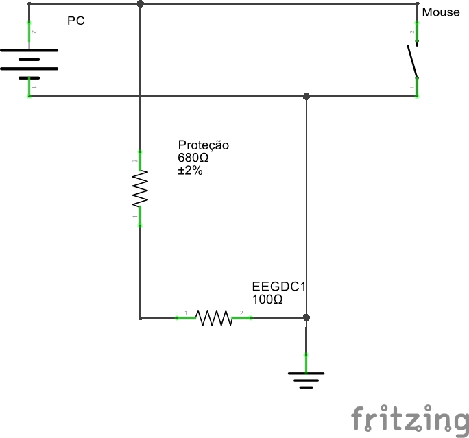
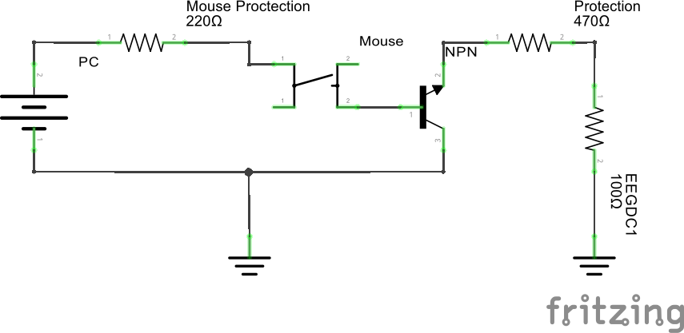
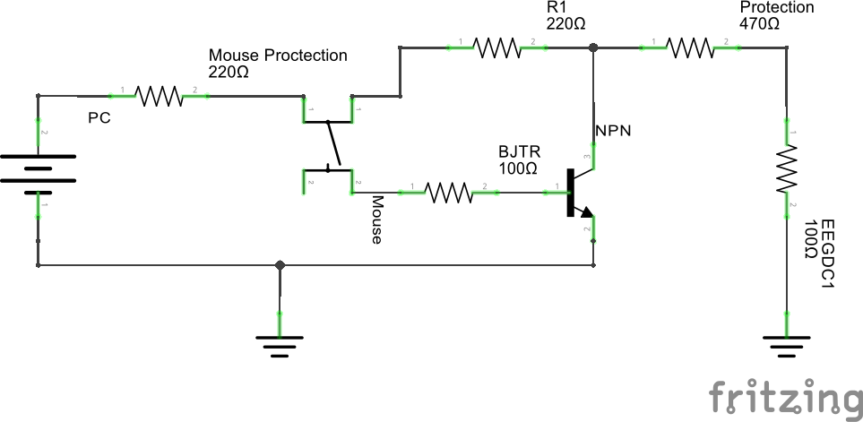

# DC Mouse

The problem is to make the Neuron-spectrum EEG receive a DC signal from a mouse click.

Initial idea
------------

Figure 1

We thought that, by clicking the mouse button, we would be able to receive an direct answer from the connection

First analysis
--------------

Mice are weird and work in weird ways. Testing some PS/2 mice, we came to the conclusion the chip that controls the mouse understand a button click as the absence of voltage in a terminal. Therefore, to identify a mouse click, we will have to measure when the button's voltage decrease. Maybe adding a filter to the cables before channeling them to the EEG?

To circumvent this, we will try to add a transistor to the mouse's circuit, so the button will only signal the EEG when it's pressed. In other words, we are 'reversing' its output voltage only for the . The circuit we will attempt is described in figure 2.

Our transistor is a NPN one.

Figure 2

After the first test, we discovered this circuit doesn't work as expected; so we decided to study more about this. After seeing this [answer](http://electronics.stackexchange.com/questions/30238/how-to-invert-a-digital-signal) in EE Stack Exchange, we discovered a circuit that will fit our needs:

In our case, the circuit will be

The prototype worked well. From now, we will try to implement this in the mouse itself.
